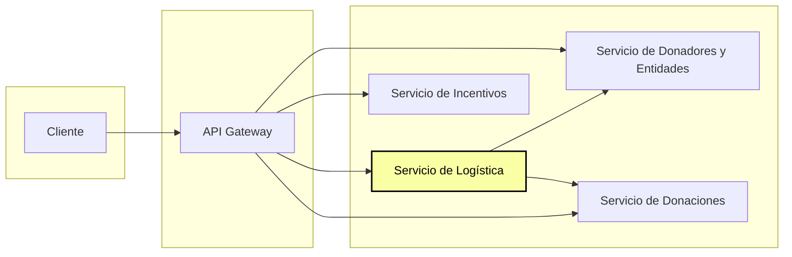

# Diagrama de Despliegue y Componentes – Servicio de Logística

```mermaid
flowchart LR
    subgraph Clients[" "]
        Cliente["Cliente"]
    end

    subgraph APILayer[" "]
        APIGateway["API Gateway"]
    end

    subgraph Services[" "]
        Logistica["Servicio de Logística"]
        Donadores["Servicio de Donadores y Entidades"]
        Donaciones["Servicio de Donaciones"]
        Incentivos["Servicio de Incentivos"]
    end

    Cliente --> APIGateway
    APIGateway --> Donadores
    APIGateway --> Logistica
    Logistica --> Donadores
    Logistica --> Donaciones
    APIGateway --> Donaciones
    APIGateway --> Incentivos

    style Logistica fill:#FAFFA6,stroke:#000000,stroke-width:2px,color:#000000
    
  
```
