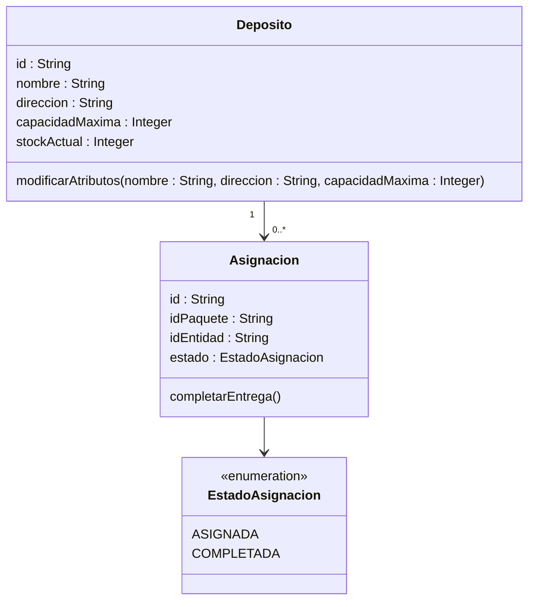

# Diagrama de Clases – Servicio de Logística

```mermaid
classDiagram
    direction TB

    class Deposito {
        id : String
        nombre : String
        direccion : String
        capacidadMaxima : Integer
        stockActual : Integer

        modificarAtributos(nombre : String, direccion : String, capacidadMaxima : Integer)
    }

    class Asignacion {
        id : String
        idPaquete : String
        idEntidad : String
        estado : EstadoAsignacion

        completarEntrega()
    }

    class EstadoAsignacion {
        ASIGNADA
        COMPLETADA
    }
    
    <<enumeration>> EstadoAsignacion
    Deposito "1" --> "0..*" Asignacion
    Asignacion --> EstadoAsignacion
```
